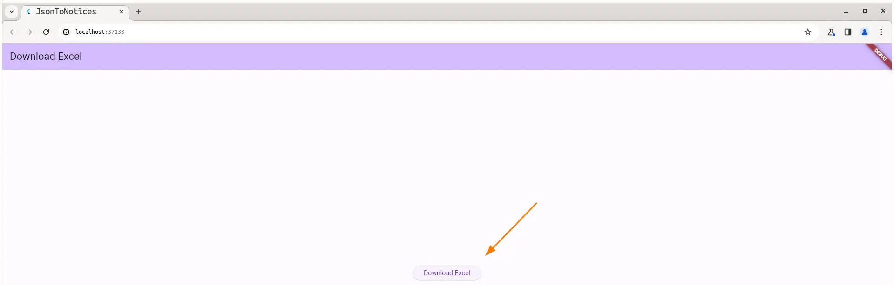
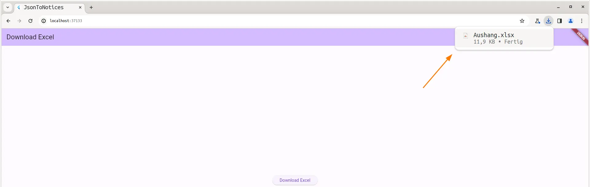
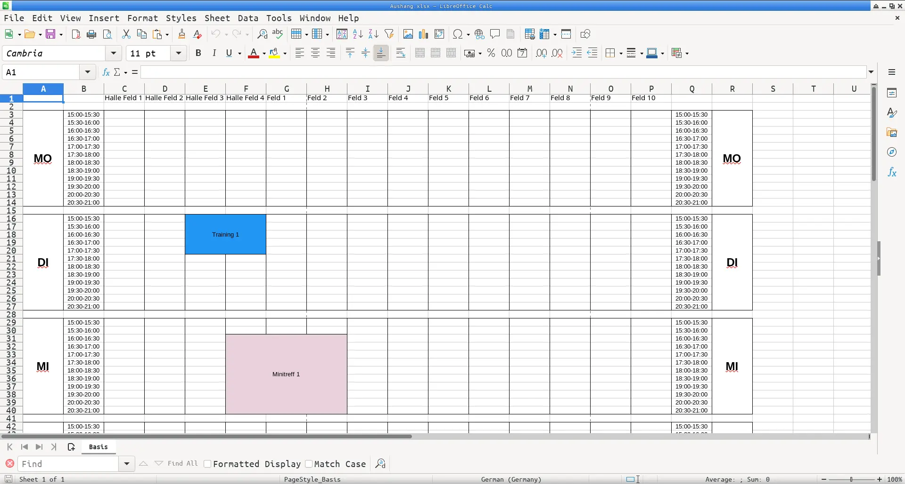
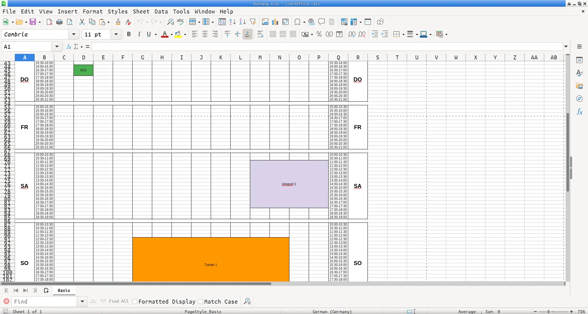

# json_to_notices

It is a prototype to automate the creation of an excel file. The file is used in my beach volleyball club to make a notice for current events during a season.

## Usage

Under lib/mocks.dart you can add your events and they will be displayed in the excel.

Start it as a web app

```bash
flutter run -d chrome
```

Click on download



and have a look on the downloaded file.



You can see the weekdays Monday, Tuesday, Wednesday in german language with 2 two events spanning multiple columns.



The same you can see for Friday, Saturday and Sunday for different events and different colors.


